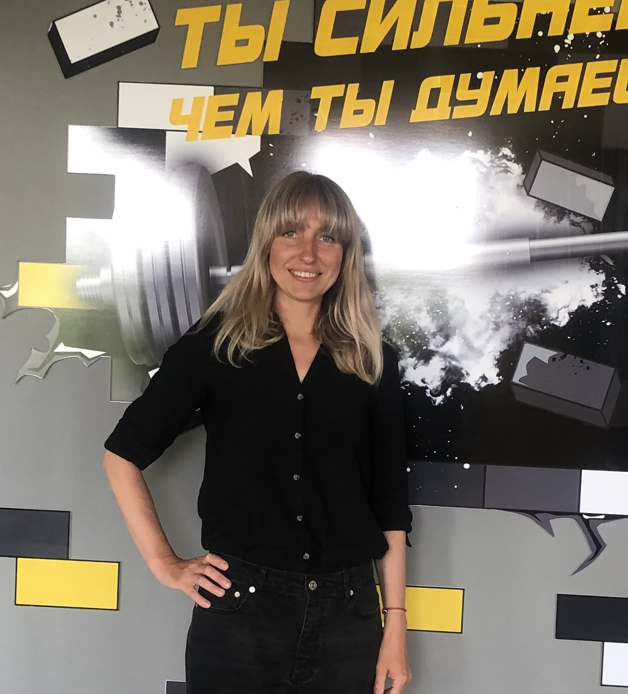

## Anastasiya Pupkevich

#### Junior Frontend Developer

---

##### **Contacts:**

- phone: +37533-329-38-80
- email: <nasta978@mail.ru>
- Discord: anastasiia050924
- discord-server rs school: anastasiia050924(@nasta987)
- GitHub: <https://github.com/nasta987/>

##### **About me.**

Hello. My name is Anastasia, I live in the city of Vitebsk, Belarus. I work in accounting, four years ago I decided to change my occupation and went for retraining on the basis of higher education, in the specialty “Information Systems and Technologies”, the training lasted two years, the training format was full-time, evening. The core subject that was throughout the course was system programming, I also studied MySQL databases, the basics of the C++ programming language, operating system architecture, computer networks and quite a bit of SSC, html, JavaScript, Node Js. After graduating from university, I independently studied JavaScript on the resource <https://learn.javascript.ru/>, solved problems on <https://leetcode.com/>, and began trying to make small websites without a server component. Now I have signed up for the JavaScript/Front-end course at [RS School](https://rs.school/ " School website ") in the hope of gaining knowledge, practical experience in creating web applications and working with a team, gaining self-confidence and finding a job after completing the course.

My strengths: desire to learn something new, positivity, responsibility and discipline, attention to detail, ability to work in a team, i have a good attitude towards people).

##### **Skills:**

- VS Code
- Postman
- Git
- HTML
- SSC
- JavaScript
- MySQL
- React
- Node Js

##### **Example code:**

let containsDuplicate = function(nums) {  
 nums.sort((a,b) => a-b);  
 for (let i = 0; i < nums.length; i++) {  
 if (nums[i] == nums[i+1]) {  
 return true;  
 }  
 }return false;  
 };  
containsDuplicate([2,14,18,22,22]);

##### **Educational projects:**

- project to create a resume using skills : Git, Markdown, and online translator). Project code - <https://github.com/nasta987/rsschool-cv>

##### **Education:**

- [RS School](https://rs.school/ " School website "), course «JavaScript/Front-end» (studying now)
- self-study of JavaScript using the resource <https://learn.javascript.ru/>, 2023г.
- [VSU named after P.M. Masherov](https://vsu.by/ " University website ") , retraining in the specialty “Information systems and technologies”, 2021 -2022гг.

##### **Languages:**

- russian
